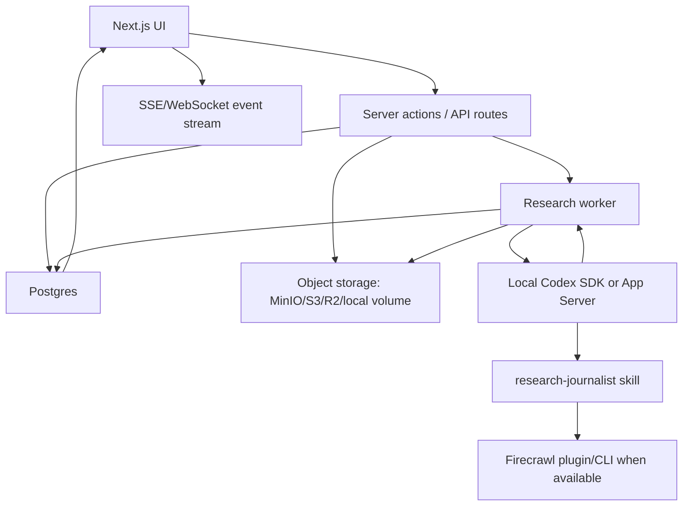

# RSRCH Pilot PRD

Current as of 2026-09-04.

## 1. Product Summary

RSRCH Pilot is a local-first Next.js dashboard for organizing research projects powered by a local Codex backend. One research instance is a project. Each project can contain multiple chats/tasks, source files, reports, and workflow cards.

The app should prioritize speed to a usable organized research workflow. Do not add authentication, collaboration, team permissions, billing, decorative marketing UI, or unnecessary visual effects for Release 1.

## 2. Chosen Approach

Use the app-led Codex integration:

```text
Next.js server action/API route
  -> @openai/codex-sdk or codex app-server
  -> starts Codex thread with "$research-journalist ..."
  -> streams events back into Postgres
  -> dashboard renders status
```

The app is the control plane and database. Codex is the research executor. Firecrawl remains an optional web collection tool available to Codex through the installed plugin/skill path.

## 2.1 Design Input Handling

The files under `prd/design` are the only design references included in this repository. They are product wireframes and visual source material, not implementation code. The product requirements in this PRD remain authoritative when imported design labels or embedded mock copy conflict with the user's requested scope.

Do not copy generated HTML or generated preview assets as application code for Release 1.

## 3. Goals

- Provide one clean local dashboard for research projects.
- Start a research task from the app without directly calling the OpenAI API.
- Use local Codex as the inference/execution backend.
- Store project metadata, task state, messages, events, sources, citations, reports, and file indexes in Postgres.
- Store larger files and generated artifacts in local-network or cloud object storage.
- Show research progress clearly while Codex is working.
- Keep the UI sparse, professional, and utilitarian.

## 4. Non-Goals

- No user authentication in Release 1.
- No multi-user roles or sharing.
- No payment/billing.
- No mobile-first redesign beyond responsive usability.
- No full custom LLM orchestration.
- No direct OpenAI API integration from the Next.js app.
- No browser-extension capture workflow.
- No complex analytics, graphs, or decorative dashboard widgets.
- No permanent storage of raw scraped website content unless explicitly retained by the user.

## 5. Users

Primary user:

- A single local operator running research projects, reviewing source trails, and organizing outputs.

Secondary future user:

- A researcher/editor who wants to revisit a project, inspect tasks, read files, and continue old Codex research threads.

## 6. Release 1 Scope

Release 1 should include only four pages:

1. Dashboard
2. Project Chatbot
3. Kanban
4. Project Files/Folders Browser

Recommended cut for fastest useful release:

- Build projects, task creation, chatbot, status events, and report/file browser first.
- Ship Kanban with simple columns and manual drag/drop only.
- Defer advanced source graphing, embeddings, search across all projects, report version comparison, and cloud storage providers until after the first usable loop works.

## 7. Visual Direction

Use the RSRCH Pilot wireframe files in `prd/design` as the visual baseline:

- [projects-overview-wireframe.svg](design/projects-overview-wireframe.svg): Projects overview, telemetry stream, worker status, and project table.
- [project-chatbot-wireframe.svg](design/project-chatbot-wireframe.svg): Project-scoped chat execution plane with thread list, transcript, source panel, and retention audit.
- [research-kanban-wireframe.svg](design/research-kanban-wireframe.svg): Five-column research workflow board with task cards and local worker context.
- [project-files-artifacts-wireframe.svg](design/project-files-artifacts-wireframe.svg): Artifact browser with reports, manifests, audits, uploads, list view, and preview panel.

Use a clean, dense, work-focused dashboard style:

- White or near-white main surface.
- Muted gray borders and dividers.
- Compact sidebar navigation.
- Top utility bar with search and small icon buttons.
- Clear table/list rows.
- Small status chips.
- Black primary buttons; use Sapphire Sky only when the imported design explicitly needs a blue primary accent.
- Minimal color used for state: running, blocked, complete, failed, priority.
- Compact cards with restrained shadows and consistent radius.
- No hero sections, marketing panels, gradient backgrounds, illustration-heavy empty states, nested cards, or ornamental UI.
- Cards only for repeated items or constrained panels.
- Page sections should feel like application workspace surfaces, not landing-page blocks.
- Do not copy sample domain labels, people, or business metrics from imported design references; only reuse the layout density, spacing, hierarchy, and component style.

### 7.1 Design Tokens

Use a mostly neutral interface with restrained accents:

| Token | Hex | Use |
| --- | --- | --- |
| Deep Navy | `#00063d` | Brand mark, key headings, selected structural accents. |
| Sapphire Sky | `#0a6acb` | Optional primary create action or active module accent; use sparingly. |
| Platinum | `#ebebeb` | Borders, column backgrounds, subtle surfaces. |
| Cayenne Red | `#f35b04` | Failed, blocked, destructive, or operator-action states. |
| Tiger Orange | `#f18701` | Running, scraping, drafting, warning, or in-progress states. |
| Emerald Seal | `#32965d` | Complete, verified, connected, cleanup passed. |
| Slate Neutral | `#71717a` | Metadata, timestamps, secondary labels. |

Typography direction:

- Use a clean sans-serif such as Geist Sans or system UI for application text.
- Use a compact monospace only for IDs, hashes, backend state, event names, storage keys, and thread/session identifiers.
- Keep headings compact; the dashboard should read like an operations console, not a marketing page.

## 8. Information Architecture

```text
/
  Dashboard

/projects/:projectId/chat
  Project Chatbot

/projects/:projectId/kanban
  Kanban

/projects/:projectId/files
  Files/Folders Browser
```

Global navigation:

- Overview
- Run Stream
- Projects
- Reports Vault
- Sources Manifest
- Audit Log
- Project module tabs: Chat / Execution, Kanban Board, Artifacts & Reports
- Settings can be omitted in Release 1 unless absolutely required for local backend endpoints.

## 9. Core Concepts

Project:

- One research instance.
- Contains one or more Codex-backed chats/tasks.
- Contains source metadata, reports, files, and cleanup/audit state.

Task:

- A unit of research work inside a project.
- Usually maps to one Codex thread.
- Can be created from chat or Kanban.
- Has status, priority, progress, assigned prompt, and latest event.

Chat:

- A task conversation with Codex.
- Stores user prompts, assistant responses, and stream events.

Source:

- A cited webpage, paper, document, filing, dataset, or other reference.
- Stores metadata and citation relationship, not necessarily full raw content.

File:

- A generated report, manifest, cleanup audit, exported source list, or user-added local file.

## 10. Page Requirements

### 10.1 Dashboard

Purpose:

- Provide a minimal overview of active research projects and current work.

Required elements:

- Left sidebar with project list.
- Top utility bar with global search and small icon actions, following the top utility treatment in [projects-overview-wireframe.svg](design/projects-overview-wireframe.svg).
- Top row with "New Project" and simple project search/filter.
- Active projects table/list modeled after [projects-overview-wireframe.svg](design/projects-overview-wireframe.svg).
- 3 to 4 compact summary cards: active projects, running tasks, blocked tasks, completed reports.
- Right-side live telemetry stream for recent Codex/worker events.
- Local execution environment panel showing Postgres, storage, and worker health.
- Each project row shows title, status, updated date, active task count, and latest report status.
- Optional right-side utility column may show active backend status and recent reports, but only if it does not delay Release 1.

Release 1 behavior:

- Create project.
- Open project chat.
- Rename project.
- Archive project.
- Show last 10 run events across projects.

Do not build:

- Charts.
- Complex metrics.
- Team activity.
- Calendar.
- Notifications.
- CPU/RAM/storage monitoring beyond static or simple health labels unless it is already available cheaply.

### 10.2 Project Chatbot

Purpose:

- Main interface for starting and continuing research using local Codex.

Required elements:

- Project header with title, status, and current backend state.
- Three-pane layout modeled after [project-chatbot-wireframe.svg](design/project-chatbot-wireframe.svg): task/chat list, transcript, and source/status side panel.
- Project module tabs: Chat / Execution, Kanban Board, Artifacts & Reports.
- Chat transcript with user prompts, Codex responses, and compact phase/event separators.
- Prompt composer.
- "Start research" command path that wraps the prompt with `$research-journalist`.
- Task selector for multiple chats/tasks within the project.
- Streaming status panel showing Codex events: queued, planning, searching, scraping, writing, verifying, cleanup, complete, failed.
- Source sidebar or collapsible source list.
- Retention/hygiene audit panel showing temporary scrape state and cleanup result.
- Save final report action.

Release 1 behavior:

- Create a new task/chat in the current project.
- Start a Codex thread using the configured local Codex backend.
- Persist prompt, events, final assistant response, source metadata, and generated report path.
- Resume an existing Codex thread when possible.
- Display failure state with retry option.

Backend requirement:

- The app should not call the OpenAI API directly.
- Preferred first integration is Codex SDK if it can run in the local Next.js server environment.
- Fallback integration is `codex app-server` over localhost WebSocket or stdio.
- Do not use deprecated `codex mcp-server` as the primary app-to-Codex path.

Prompt convention:

```text
Use $research-journalist for this project.

Project: <project title>
Task: <task title>
User request:
<prompt>

Persist final report and source manifest for this project. Avoid retaining raw scraped content unless explicitly requested.
```

### 10.3 Kanban

Purpose:

- Organize research work across simple workflow states.

Required columns:

- Backlog
- Researching
- Drafting
- Review
- Done

Required card fields:

- Task title
- Status
- Priority
- Short one-line description or latest event
- Last updated
- Linked chat/thread
- Report indicator
- Blocked reason when applicable

Visual behavior:

- Model the board after [research-kanban-wireframe.svg](design/research-kanban-wireframe.svg): horizontal columns, compact cards, small priority chips, subtle progress bars only when useful, and a toolbar with search/filter/sort/add task.
- Include a compact worker/session context strip when a project has active work.

Release 1 behavior:

- Add task.
- Edit title/status/priority.
- Drag task between columns.
- Open linked chat.
- Mark blocked/done.

Do not build:

- Assignees.
- Sprint planning.
- Swimlanes.
- Automation rules.
- Dependencies.

### 10.4 Project Files/Folders Browser

Purpose:

- Browse generated research artifacts and project-organized files.

Required elements:

- Folder tree.
- File list.
- File preview for markdown/text/json.
- Metadata panel with size, created date, source task, retention class, and cleanup status.
- Actions: open, rename, delete, download/export.
- Category summary cards for final reports, source manifests, cleanup audits, and uploaded papers.
- Grid/list toggle and compact search/filter controls, following [project-files-artifacts-wireframe.svg](design/project-files-artifacts-wireframe.svg).
- Right preview panel for selected markdown reports, source manifests, and cleanup audits.

Release 1 behavior:

- Show files from object storage or local storage.
- Preview markdown reports and source manifests.
- Show generated cleanup audits.
- Link files back to project tasks.

Retention classes:

- `final_report`: retained.
- `source_manifest`: retained.
- `cleanup_audit`: retained.
- `user_file`: retained until user deletes.
- `temporary_scrape`: deleted after completion.
- `temporary_notes`: deleted after completion unless scrubbed.

Release 1 should call cleanup records "cleanup audits" or "cleanup receipts." Do not require cryptographic signing or immutable object locking in Release 1 unless it is trivial to add.

## 11. Backend Architecture



Implementation note:

- Prefer a worker process over long-running work inside a request handler.
- The server action/API route should enqueue work and return a task ID quickly.
- The worker should start/continue the Codex thread and write events to Postgres.
- The dashboard should subscribe to events through SSE or WebSocket.

## 12. Codex Integration Options

### Option A: Codex SDK

Use when the SDK can be run from the local Next.js server runtime and can access the local Codex environment/session. The official Codex SDK docs show starting a thread, running a prompt, continuing a thread, and resuming by thread ID.

Pros:

- Cleanest app-led API.
- Natural TypeScript fit.
- Easier to model project/task/thread relationships.

Risks:

- Must verify local auth/session behavior.
- Must verify event streaming support needed by the dashboard.
- SDK behavior and packaging may change.

Source: https://learn.chatgpt.com/docs/codex-sdk

### Option B: Codex App Server

Use when deeper local-client integration is needed. Official docs describe the app-server interface as the interface Codex uses to power rich clients, including authentication, conversation history, approvals, and streamed agent events.

Pros:

- Better fit for a rich dashboard that needs streamed events.
- Can run as a local service.
- Has documented JSON-RPC/WebSocket primitives.

Risks:

- WebSocket mode is documented as experimental and unsupported for production.
- Non-local connections require TLS/auth discipline.
- More integration work than SDK.

Source: https://learn.chatgpt.com/docs/app-server

### Option C: MCP

Use MCP for tools exposed by this app to Codex, not as the primary inference channel. A future MCP server can expose tools such as:

- `create_project`
- `append_run_event`
- `record_source`
- `save_report`
- `write_cleanup_audit`

OpenAI documentation describes MCP as a way for AI clients to discover and call external tools/data. It is not the preferred way for the dashboard itself to "call ChatGPT for inference."

Source: https://developers.openai.com/plugins/concepts/mcp-server

## 13. Data Model

Release 1 entities:

```text
projects
  id
  title
  description
  status
  created_at
  updated_at
  archived_at

tasks
  id
  project_id
  title
  status
  priority
  codex_thread_id
  current_phase
  blocked_reason
  created_at
  updated_at

messages
  id
  task_id
  role
  content
  created_at

run_events
  id
  task_id
  event_type
  phase
  message
  payload_json
  created_at

sources
  id
  project_id
  task_id
  title
  url
  author
  publisher
  published_at
  retrieved_at
  source_type
  retention_status

reports
  id
  project_id
  task_id
  title
  storage_key
  status
  created_at
  updated_at

files
  id
  project_id
  task_id
  parent_id
  name
  storage_key
  mime_type
  size_bytes
  retention_class
  created_at
  updated_at

cleanup_audits
  id
  project_id
  task_id
  deleted_items_json
  retained_items_json
  failed_items_json
  created_at
```

Do not store raw scraped page bodies in `sources`. If raw content must exist during a run, store it as temporary object storage with a retention class that the cleanup job deletes.

## 14. Storage Options

Release 1 recommended:

- Postgres on the local machine or a LAN server.
- MinIO on a LAN server for object storage.

Acceptable alternatives:

- Cloud Postgres plus S3/R2 if local network reliability is poor.
- Local filesystem storage for the first prototype, behind the same storage interface.

Object storage buckets/prefixes:

```text
zeal-rsrch/
  projects/<project-id>/reports/
  projects/<project-id>/manifests/
  projects/<project-id>/audits/
  projects/<project-id>/uploads/
  tmp/<task-id>/
```

Cleanup rule:

- Delete `tmp/<task-id>/` after successful report generation or failed run timeout.

## 15. Event Model

Minimum event types:

- `task_created`
- `codex_thread_started`
- `planning_started`
- `search_started`
- `source_found`
- `source_read`
- `draft_started`
- `verification_started`
- `cleanup_started`
- `report_saved`
- `task_completed`
- `task_failed`
- `task_blocked`

Events should be append-only. The task row stores the latest normalized state for fast UI rendering.

## 16. Research Skill Dependency

The `research-journalist` skill is a required dependency for the desired research behavior. The current provided skill content is still scaffold/TODO text, so Release 1 has a prerequisite:

- Finalize `~/.codex/skills/research-journalist/SKILL.md`.
- Ensure it tells Codex to use Firecrawl when available.
- Ensure it enforces source manifest, original prose, citation verification, and cleanup behavior.

The dashboard should treat the skill name as configurable, with `$research-journalist` as the default.

## 17. Firecrawl Dependency

Firecrawl is optional but recommended for robust live-web collection. The Codex thread should use the Firecrawl plugin/CLI when available for:

- Search when no URL is known.
- Scrape when a URL is known.
- Map for known websites.
- Crawl only for bounded site sections.
- Research index for paper discovery.

The app should not directly depend on Firecrawl in Release 1 unless needed. Let Codex and the skill decide when to use Firecrawl.

## 18. Privacy And Retention

Required behavior:

- Keep final reports, source manifests, cleanup audits, and user-uploaded files.
- Delete temporary scrape output, copied source bodies, and temporary notes after task completion.
- Show cleanup result in the task and files UI.
- Avoid logging raw scraped content into `run_events`.
- Store source metadata and citations separately from raw content.

Postgres should contain metadata and short event messages. Object storage should hold files and temporary artifacts.

## 19. Error States

The UI must clearly represent:

- Local Codex backend unavailable.
- Codex task requires user approval.
- Firecrawl unavailable/out of credits.
- Search failed.
- Scrape blocked or incomplete.
- Report verification failed.
- Cleanup partially failed.
- Storage unavailable.
- Postgres unavailable.

Each error should show a short cause and one next action, such as retry, open task, or view audit.

## 20. Acceptance Criteria

Release 1 is acceptable when:

- User can create a project.
- User can start a research task from the chatbot.
- The app starts a local Codex thread with `$research-journalist`.
- Events stream into Postgres and render in the UI.
- User can see active/completed/failed tasks on the dashboard.
- User can move tasks through the Kanban board.
- User can browse generated reports/manifests/audits in the files page.
- No direct OpenAI API call exists in the Next.js app.
- Temporary scrape artifacts are deleted or marked with a cleanup failure.
- The UI has no auth, no team features, and no decorative marketing surfaces.

## 21. Key Risks

| Risk | Impact | Mitigation |
| --- | --- | --- |
| Codex SDK cannot be used as expected from Next.js | Blocks app-led task launching | Spike SDK first; fallback to app-server. |
| App Server WebSocket mode is not production-supported | Local integration fragility | Keep Release 1 local-only; avoid remote exposure. |
| Research skill remains unfinished | Poor research quality | Finalize `research-journalist` before building dashboard behavior. |
| Raw scraped content persists accidentally | Legal/privacy risk | Retention classes, cleanup job, and cleanup audit. |
| Long-running request timeouts | Task failure | Use worker queue, not request-thread execution. |
| Firecrawl output contains prompt injection | Bad agent behavior | Treat scraped content as untrusted and inspect incrementally. |
| Local network storage unavailable | Missing reports/files | Show storage health and retry failed writes. |

## 22. Suggested Release Plan

### Release 0: Integration Spike

- Verify Codex SDK can start/resume a thread locally.
- Verify event streaming or final-response polling.
- Verify `codex app-server` fallback.
- Verify the finalized `research-journalist` skill is loaded.

### Release 1: Organized Research MVP

- Project CRUD without auth.
- Chatbot page.
- Worker-backed task execution.
- Event persistence.
- Minimal dashboard.
- Simple Kanban.
- Files browser for reports/manifests/audits.
- Cleanup audit display.

### Release 2: Quality Improvements

- Source/citation detail pages.
- Better report versioning.
- Search across project reports.
- Configurable storage backends.
- MCP server tools for Codex-to-dashboard writes.

### Release 3: Productization

- Auth if needed.
- Multi-user collaboration.
- Remote deployment.
- Cloud storage management.
- Advanced research evaluation.

## 23. Open Questions

- Should Release 1 use Codex SDK first, or go straight to App Server for streaming?
- Should object storage start as local filesystem to move faster, then migrate to MinIO?
- Should task execution be one worker process or multiple concurrent workers?
- Should the app store full final chat transcripts permanently, or only final reports plus selected messages?
- Should raw source retention ever be allowed behind an explicit debug flag?

## 24. References

- Codex SDK: https://learn.chatgpt.com/docs/codex-sdk
- Codex App Server: https://learn.chatgpt.com/docs/app-server
- OpenAI MCP server concept: https://developers.openai.com/plugins/concepts/mcp-server
- MCP and connectors guide: https://developers.openai.com/api/docs/guides/tools-connectors-mcp
